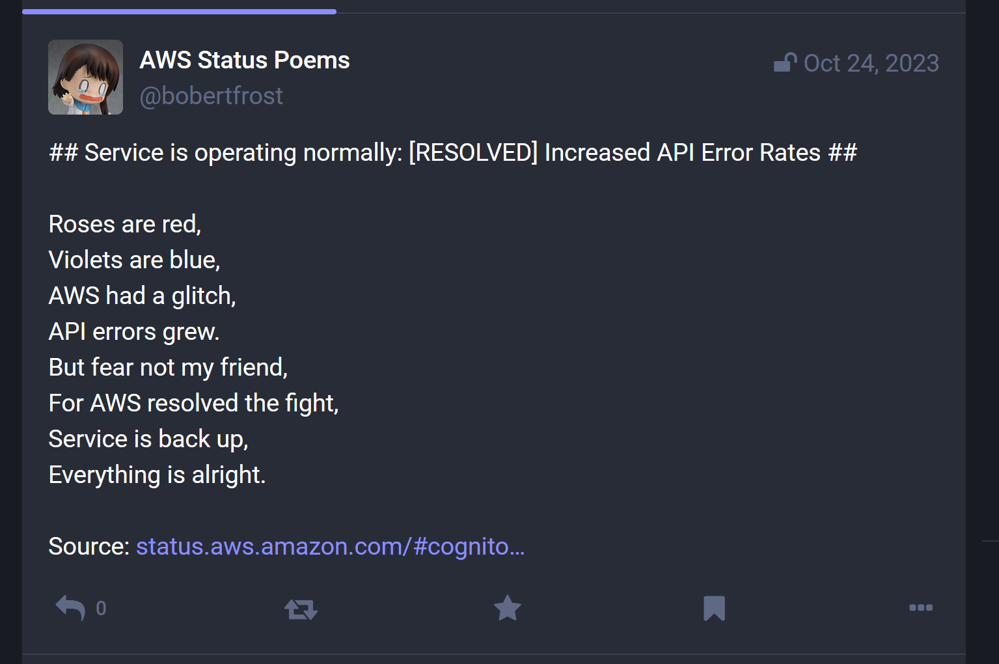

# AWS Status Poem Bot

A Mastodon bot that writes poems about AWS statuses.



## Getting Started

### Generate Gemini API key

Create a Google Cloud account and create a new project.

Go to https://aistudio.google.com/app/apikey.

Create an API key and select your project.

Copy the key value. This will be `GEMINI_API_KEY`.

### Generate Mastodon API key

Go to Mastodon instance of choice and create an account.

Go to Settings->Development and click "New application".

Create an app with the following permissions:

- `write:statuses`

Copy the access token from the app. This will be `MSTDN_ACCESS_TOKEN`.

### Setup Cloudflare worker

Setup KV namespaces:

```
wrangler kv:namespace create FEED_ITEMS
wrangler kv:namespace create FEED_ITEMS --preview
```

Upload respective secrets via Wrangler:

```
wrangler secret put GEMINI_API_KEY
wrangler secret put MSTDN_ACCESS_TOKEN
```

Create `.env` from `sample.env` and fill with proper values (the default
Mastodon instance is mastodon.social).

Generate `wrangler.toml` with script:

```
pip install -r "requirements.txt"
pyhon scripts/generate_wrangler.py
```

### Development

Create `.dev.vars` from `sample.dev.vars`.

Replace values with secrets generated above.

Run the worker in scheduled mode with:

```
yarn start
```

Trigger the worker with:

```
curl "http://localhost:8787/__scheduled?cron=*+*+*+*+*"
```

### Release

Deploy worker with:

```
yarn deploy
```
